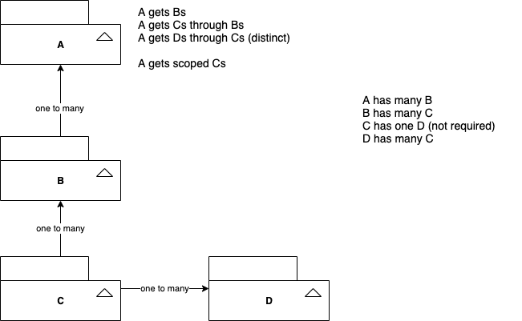

# Issue with ActiveRecord#includes

Checked with the latest rails versions

- 5.2.4.4
- 6.1.1

## Models



## The Problem

- c_type_xs is scoped has_many in A through Bs (source Cs)
- ds is distinct has_many in A through Cs

Under this condition, if you switch around the orders in includes, you get different results.

### spec/models/a_spec.rb

```rb
it { expect(A.includes(:c_type_xs, :ds).find(subject.id).c_type_xs.size).to eq 1 }
it("if you switch includes around, you get different results") do
  expect(A.includes(:ds, :c_type_xs).find(subject.id).c_type_xs.size).to eq 1
end
```

## How to reproduce

Just run the docker, and it will run rspec automatically.

```
$ git clone && cd activerecord-includes
$ docker-compose run --rm rails-5.2.x
$ docker-compose run --rm rails-6.1.x
```
